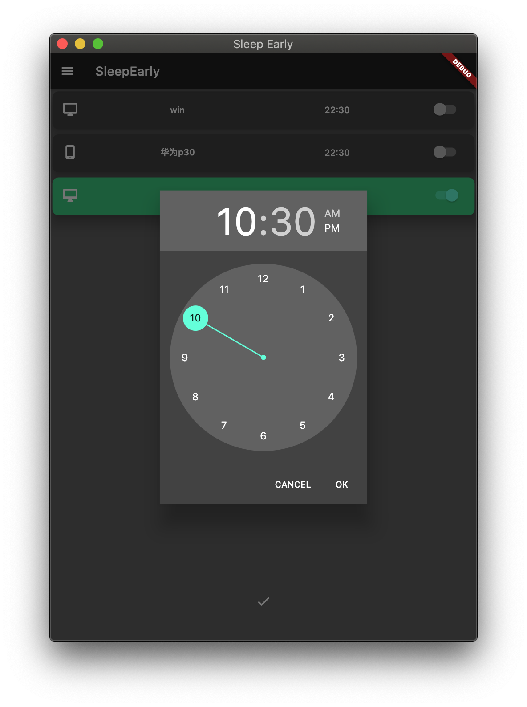

# sleep_early

早点睡

## 价值主张

唯有早睡不可辜负

## 描述

无奈最近因为各种事情而导致拖延晚于`10:30`睡觉，
有时是`mac`或者`win10`上的代码，
有时是`ipad`里的剧，
有时是`电话`里的女友，
所以希望能有个强制性的监督管理机制，强迫自己关机睡觉

## 运行

主体为[flutter](https://github.com/flutter/flutter)项目,Desktop使用的是[go-flutter](https://github.com/go-flutter-desktop/go-flutter#getting-started)

## 界面

- 登录

- 校验

- 注册

- 设备绑定

- Home

- Time

- Menu

- 个人信息

## Done

- [x] Home界面
- [x] 设备绑定
- [x] 全端(os)适配
  - [x] android
  - [x] ios
  - [x] windows
  - [x] linux
  - [x] macos
- [x] 定时关机
  - [x] windows
  - [x] linux
  - [x] macos
- [x] 注册
  - [x] email
- [x] 登录
  - [x] email 

## Todo

- [ ] 未登录
  - [ ] 仅控制本设备
- [ ] 定时关机
  - [ ] android
  - [ ] ios
- [ ] 第三方登录
  - [ ] github

## Delay
- [ ] 注册
  - [ ] phone
- [ ] 登录
  - [ ] phone
- [ ] 第三方登录
  - [ ] wechat

## Plan

全部计划请移步[SleepEarly](https://github.com/orgs/di1shuai/projects/1)查看